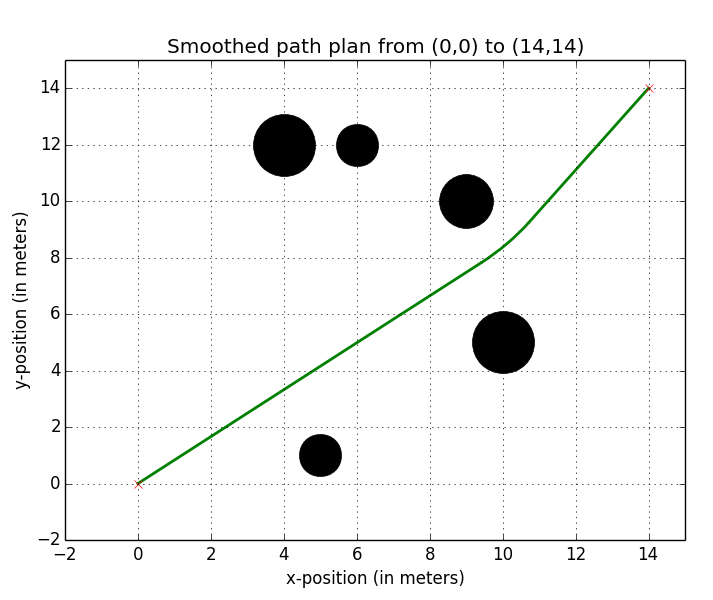
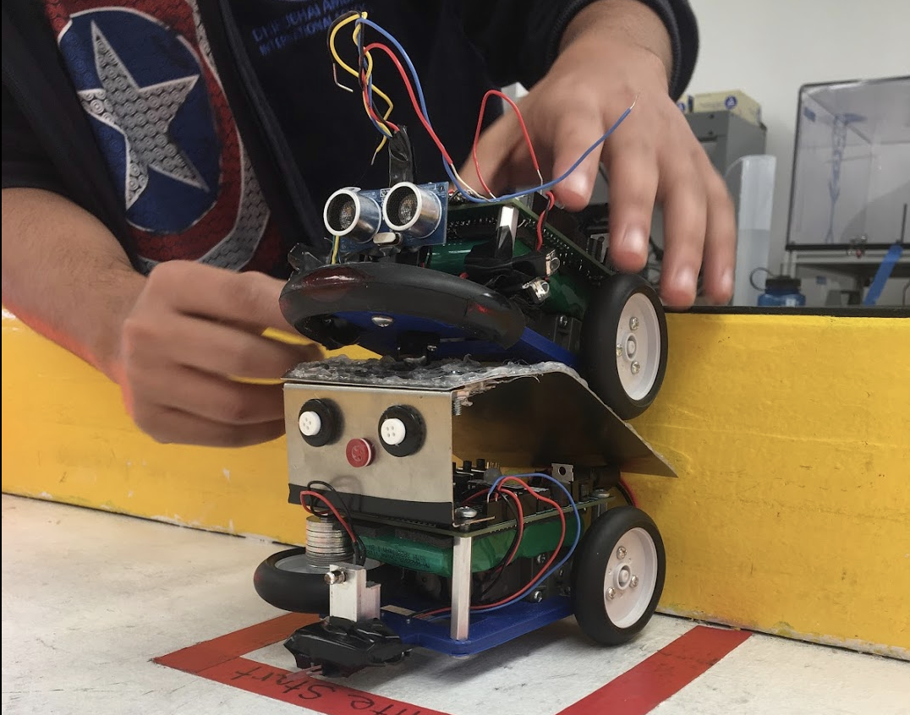
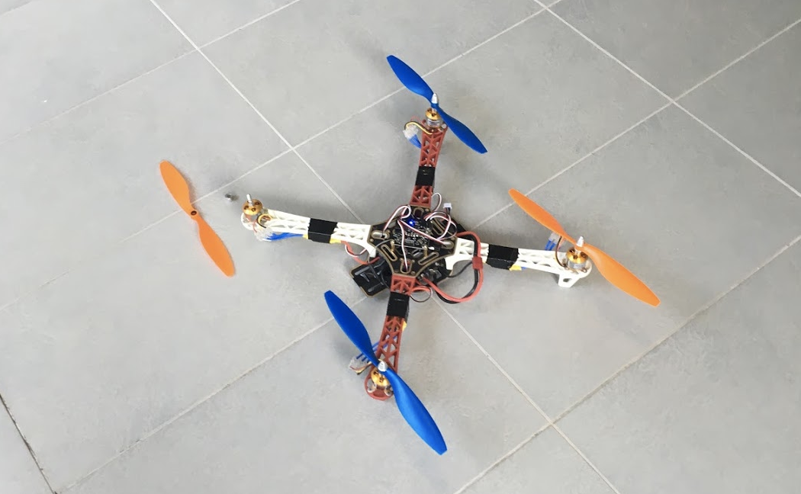
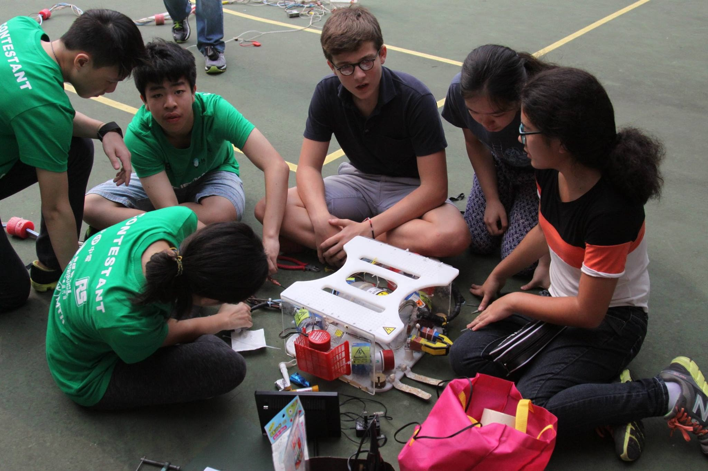

<!-- Main -->

<!-- One -->
<section id="one" class="spotlights">
	<section>
		
		

			

				<header class="major">
					<h3>Spring 2019: Autonomous Ocean Robot</h3>
				</header>
				
For an engineering class, my team and I built a robot that could navigate autonomously to gather data about wind speed and current speed near-shore, in order to quantify the effects of one on the other.

				<ul class="actions">
					<li><a href="#" class="button">Learn more</a></li>
				</ul>
			

		

	</section>
	<section>
		
		

			

				<header class="major">
					<h3>Summer 2018: Autonomous Loader</h3>
				</header>
				
During the summer of 2018, I worked in the Lab for Autonomous and Intelligent Robotics at Harvey Mudd College, writing code and designing sensor systems that would allow a construction loader to traverse an unmapped area and avoid obstacles.

				<ul class="actions">
					<li><a href="projects/autonomous-loader.html" class="button">Learn more</a></li>
				</ul>
			

		

	</section>
	<section>
		
		

			

				<header class="major">
					<h3>Fall 2017: Gemini</h3>
				</header>
				
In my first semester of college, I took an Autonomous Vehicles class, where I designed, programmed and constructed two autonomous robots over 45+ hours using Arduino, with a teammate. We placed second out of over 20 teams.

				<ul class="actions">
					<li><a href="#" class="button">Learn more</a></li>
				</ul>
			

		

	</section>
	<section>
		
		

			

				<header class="major">
					<h3>Fall 2016: Drone</h3>
				</header>
				
Didn't work out so well.

			

		

	</section>
	<section>
		
		

			

				<header class="major">
					<h3>Fall 2015 - Spring 2016: Arnold</h3>
				</header>
				
Named after our then-headmistress' husband.

				<ul class="actions">
					<li><a href="#" class="button">Learn more</a></li>
				</ul>
			

		

	</section>
	<section>
		
		

			

				<header class="major">
					<h3>Spring 2015: Rex Powers</h3>
				</header>
				
We wanted to choose a name that 'sounded like it could belong to a porn star'.

				<ul class="actions">
					<li><a href="#" class="button">Learn more</a></li>
				</ul>
			

		

	</section>
</section>

