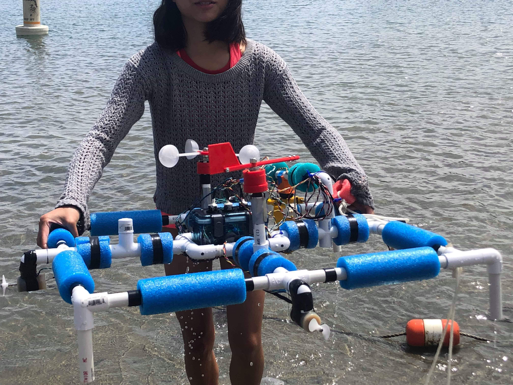
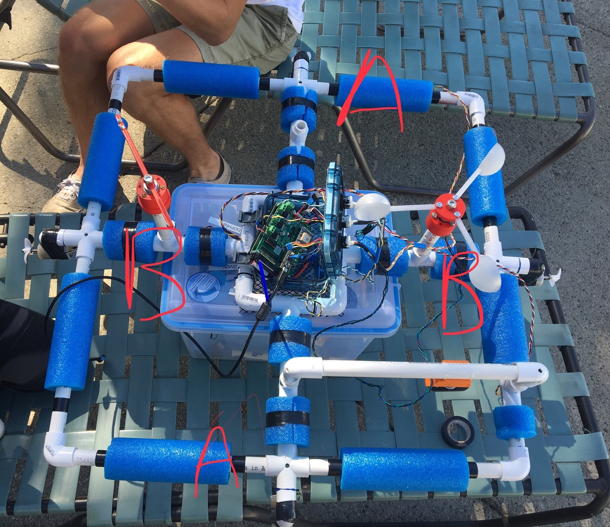

  
  

For an experimental engineering class, my team of 4 built an autonomous ocean robot to determine the wind-current relationship near shore. We implemented PD control to have robot navigate autonomously to different waypoints and hold its position within a 1m radius of a waypoint, while gathering data in turbulent conditions. We also designed sensor mounts that could rotate to track the heading of a weather vane using Python and Arduino.

    <object data="../assets/files/e80report.pdf" width="600" height="600" type='application/pdf'>

